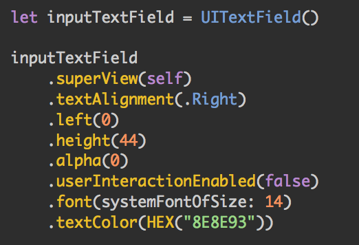
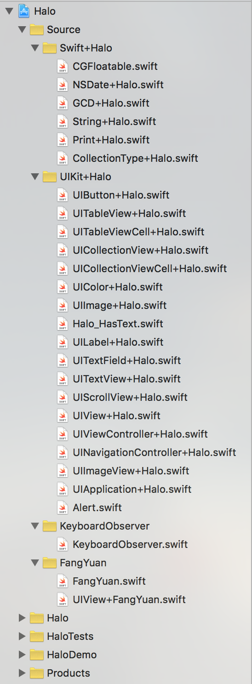
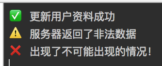
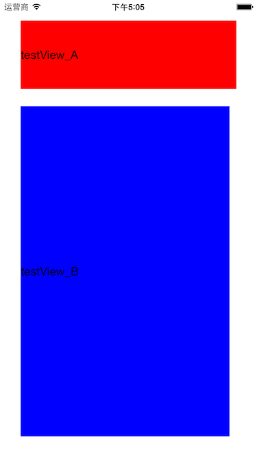

## 简介

Halo 是我使用 Swift 开发 iOS 应用一年下来所积累的一个工具库（当然也会有些以前 ObjC 的“遗老”），这篇文章中我会简单说明一下自己是如何设计并使用 Halo 的

Halo 的名字取自一款叫做 [HALO](https://www.halowaypoint.com/en-us) 的游戏。我比较喜欢这款游戏宏大的背景，所以就叫做这个名字了

## Tips

- Halo 使用 Swift 编写，仅支持 iOS 平台
- 我现在使用 CocoaPods 将 Halo 集成进自己的项目（PS: `pod search Halo`）

### 链式语法

Halo 中很多方法都是为了实现链式语法，或者带有链式语法的特性

非链式语法：

	object.propertyA = valueA
	object.propertyB = valueB
	object.propertyC = valueC
	object.propertyD = valueD

链式语法：

	object
		.propertyA(valueA)
		.propertyB(valueB)
		.propertyC(valueC)
		.propertyD(valueD)
		
效果图：

		
我这样作的主要原因有：

- 不喜欢在设置 object 的若干属性时每次都要多写一个 object
- 可以在 map 等函数中设置属性的同时返回结果

这种方法的基本实现为：

	extension Class {
		//	Chainable method of property
		func property(property: propertyType) -> Self {
			self.property = property
			return self
		}
	}

## Halo 详细介绍

Halo.framework 工程目录如下图：

接下来的时间，我会介绍一下 Source 目录下各个文件实现的主要功能
### Swift+Halo
#### CGFloatable.swift
该文件提供了一个`CGFloatable`协议，主要是觉得在 Swift 编译器总是认为 "1" 是`Int`值，和`CGFloat`数据使用时总会出先编译错误。所以为`Int`、`Double`、`Float`实现了`CGFloatable `协议，通过 `.f` 的形式快速转化为`CGFloat`（而不是麻烦的 `CGFloat(X)`）
同时在此基础上，使用硬编码对屏幕适配做了一些处理

#### Print+Halo.swift
通过`ccRight`、`ccWarning`、`ccError`输出表情符号方便调试
之后我们可以在控制台输出像这样的东西：

### UIKit+Halo
这个目录下的文件以 `extension` 的形式大量的实现了 UIKit 一些常用控件的链式语法，以方便日常开发的使用

除此之外，还有一些边边角角的东西：

- UITableView/UICollectionView 利用泛型快速注册/重用单元格方法
- 使用 Hex 值初始化 UIColor
- UIImage静态模糊
- UIView 截屏
- 文本显示所需高度计算
- UIAlertController 封装
...

### KeyboardObserver

实现这个类主要是原来每次在不同 `UIViewController` 中处理键盘事件，写了很多重复代码，被恶心到了(-_-!)

假设我们需要在 ViewController 类中监听键盘高度，只需要设置（我通常在 viewDidLoad 方法中）：

	KeyboardObserver.delegate = self
	
让 ViewController 实现相关协议：

	// MARK: - KeyboardObserverDelegate
	extension ViewController : KeyboardObserverDelegate {
		func keyboardWillChangeToHeight(height: CGFloat, duration: NSTimeInterval) {
			//	height 就是键盘即将改变到的高度
		}
	}

如果你还想使用 Halo 对 `UIScrollView` 的拓展，再调用一下 `insetBottom()` 就可以方便快捷的实现键盘高度变化的响应了~

    	func keyboardWillChangeToHeight(height: CGFloat, duration: NSTimeInterval) 
    		scrollView.insetBottom(height)
    	}

PS：方便归方便，但是这个类的我写的有点乱，有机会一定好好整理一下！

### 方圆（FangYuan）

Update: 现在方圆在[这里](https://github.com/HaloWang/FangYuan)

一套微型布局库，使用 `UIView.frame` 进行布局，功能简单，上手快速！

#### 我是这样想的
- 任何一个 `UIView` ，我们知道其在 X 轴上的`宽度`、`<左边-父视图左边>距离`、`<右边-父视图右边>距离`中的任意两者，即可确定`UIView.frame.origin.x`和`UIView.frame.size.width`
- 任何一个 `UIView` ，我们知道其在 Y 轴上的`高度`、`<上边-父视图上边>距离`、`<下边-下视图右边>距离`中的任意两者，即可确定`UIView.frame.origin.y`和`UIView.frame.size.height`
- 通过前两步，即可确定该 `UIView` 的 `frame` 
- 予以实现

#### 简单展示

假设我们想达到这样的需求：

	1、testView_A
		距离顶部30，距离右侧30，高度为100，距离左侧30
	2、testView_B
		距离 testView_A 的底部 25
		距离 superView 左侧的距离等于 testView_A 距离 superView 左侧的距离
		距离 superView 右侧的距离等于 testView_A 距离 superView 右侧的距离 + 10
		距离 superView 底部的距离等于 30

效果图：

### 不使用任何第三方布局方式：

	class ViewController: UIViewController {
	
		let testView_A = UILabel()
	
		let testView_B = UILabel()

		override func viewDidLoad() {
			super.viewDidLoad()
		
			view.addSubview(testView_A)
			view.addSubview(testView_B)
		
			testView_A.text = "testView_A"
			testView_B.text = "testView_B"
		
			var frameA = CGRectZero
			frameA.origin.x = 30
			frameA.origin.y = 30
			frameA.size.width = UIScreen.mainScreen().bounds.size.width - frameA.origin.x - 30
			frameA.size.height = 100
			testView_A.frame = frameA
		
			var frameB = CGRectZero
			frameB.origin.x = testView_A.frame.origin.x
			frameB.origin.y = testView_A.frame.origin.y + testView_A.frame.size.height + 25
			frameB.size.width = UIScreen.mainScreen().bounds.size.width - testView_A.frame.origin.x - (testView_A.superview!.frame.size.width - (testView_A.frame.origin.x + testView_A.frame.size.width)) - 10
			frameB.size.height = UIScreen.mainScreen().bounds.size.height - frameB.origin.y - 30
			testView_B.frame = frameB
		
		
			testView_A.backgroundColor = UIColor.redColor()
			testView_B.backgroundColor = UIColor.blueColor()
		}
	}
	
使用 FangYuan：

	import UIKit
	import Halo

	class ViewController: UIViewController {
		
		let testView_A = UILabel()
		
		let testView_B = UILabel()

		override func viewDidLoad() {
			super.viewDidLoad()
			
			view.addSubview(testView_A)
			view.addSubview(testView_B)
			
			testView_A.text = "testView_A"
			testView_B.text = "testView_B"
			
			//	------- 主要变化 -------
			
			testView_A
				.top(30)
				.right(30)
				.height(100)
				.left(30)
			
			testView_B
				.top(testView_A.chainBottom + 25)
				.left(testView_A.left)
				.right(testView_A.right + 10)
				.bottom(30)
				
			//	---------------------
			
			testView_A.backgroundColor = UIColor.redColor()
			testView_B.backgroundColor = UIColor.blueColor()
		}
	}

可以看到 FangYuan 能简化很多代码，就算是和 Masonry 相比，也能省下不少代码，同时也还能实现同样的效果
	
#### FangYuan 的缺点

- 需要知道在`UIView.superView`存在时才有效
- FangYuan 的诸多方法需要在`layoutSubviews`或`viewWillLayoutSubviews`调用才能保证随`superView.frame`的变化而变化，比如上述代码的ViewController外如果嵌套在一个 NavigationController中，会出现这种情况（因为FangYuan的方法写在了`viewDidLoad`中）：

#### FangYuan 的使用情况

我在最近的一个[项目](https://itunes.apple.com/cn/app/quan-min-mo-te-ti-gong-gao/id1086009210?mt=8)中，**仅仅**使用了 Halo.FangYuan 就实现了整个项目的布局😁

## 如何在你的项目中集成 Halo.framework

### CocoaPods（推荐）

直接使用 `pod 'Halo'`，不要忘记 `use_frameworks!`~

### Carthage
1、直接在[Github](https://github.com/HaloWang/Halo)下载下来整个项目
2、打开终端
3、cd [解压缩后的工程目录]
4、carthage build --no-skip-current
5、在工程目录中 Carthage/Build/iOS/ 中找到 Halo.framework
6、接下来就是将 Halo.framework 集成到你的工程中了，相信大家看到这里，应该都肯定会的吧~

#### 使用 Carthage 上线到 AppStore 时的坑

使用上述方法集成的 Halo.framework 在（且仅在）上传至 AppStore 时会出错，原因是将 Halo.framework 中多余的 Architectures 打包进了索要上传的应用程序包中，解决方案大家可以参照[这里](http://ikennd.ac/blog/2015/02/stripping-unwanted-architectures-from-dynamic-libraries-in-xcode/)或者[Stackoverflow](http://stackoverflow.com/questions/35240330/errors-building-xcode-project-after-adding-in-run-script-fatal-error-lipo-inpu/35240555)

囧，这个分明是我的锅啊，有时间一定解决！

## 总结

### 现在

总得来说，Halo.framework 是很多小工具的集合，我本着快捷、高效、代码美观、意义明晰的想法去设计向其中不断整合代码。

平时写项目，写Demo感觉根本离不开~不过，相比于网上知名的第三方库来说，就羸弱很多了😓

### 将来

最近读了喵神的[如何打造一个让人愉快的框架](https://onevcat.com/2016/01/create-framework/)，感觉自己的 Halo 即便仅仅是个人使用，也有很多可以改进的地方，比如：

- 你还没有对 FangYuan 进行过性能优化啊？
- FangYuan 一定要在`layoutSubviews`或`viewWillLayoutSubviews`才能保证使用FangYuan的`UIView`的`superView`一定存在吗？才能保证任何 frame 变动时，约束都能生效吗？是不是可以利用 runtime 做一些事情呢？
- 书写链式语法时，在代码自动补齐方面，总是跟 UIKit 原有的属性相冲突，为了快速书写，也为了避免和其他第三方库产生可能的冲突，是不是应该添加前缀？

有机会的话，我一定会不断积累下去的！